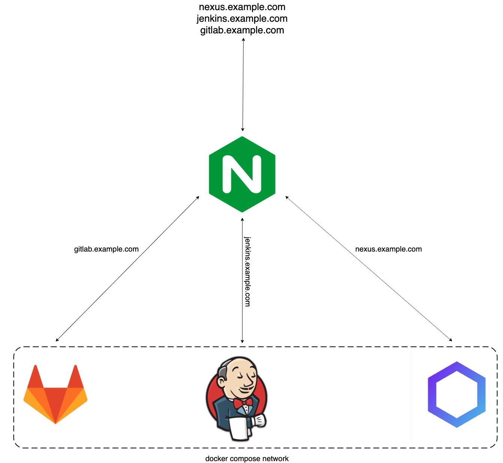

# Jenkins, Nexus and GitLab docker compose

Run the latest version of Jenkins,  Nexus and GitLab with Docker Compose.
It gives you the ability to use GitLab as git repository, Jenkins as CI server and  Nexus to manage binaries and build artifacts across your software supply chain. 
Based on the official Docker images from Jenkins and Nexus :
* [Jenkins](https://github.com/jenkinsci/docker)
* [Nexus](https://github.com/sonatype/docker-nexus3)
* [Nginx](https://github.com/nginxinc/docker-nginx)

Also GitLab based on [Dockerized GitLab](https://github.com/sameersbn/docker-gitlab).

## Contents

1. [Requirements](#requirements)
   * [Host setup](#host-setup)

## Requirements

### Host setup

* [Docker Engine](https://docs.docker.com/install/) 
* [Docker Compose](https://docs.docker.com/compose/install/)

# Services Architecture

